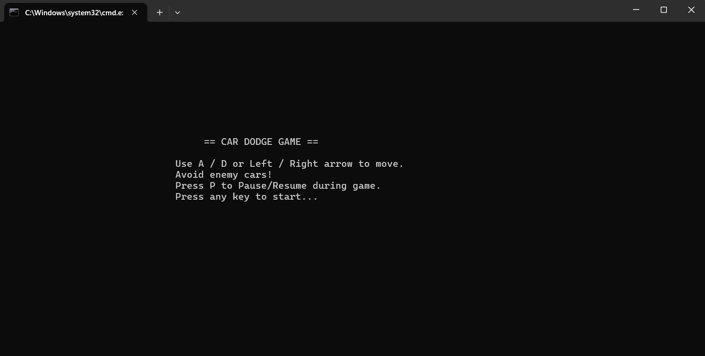
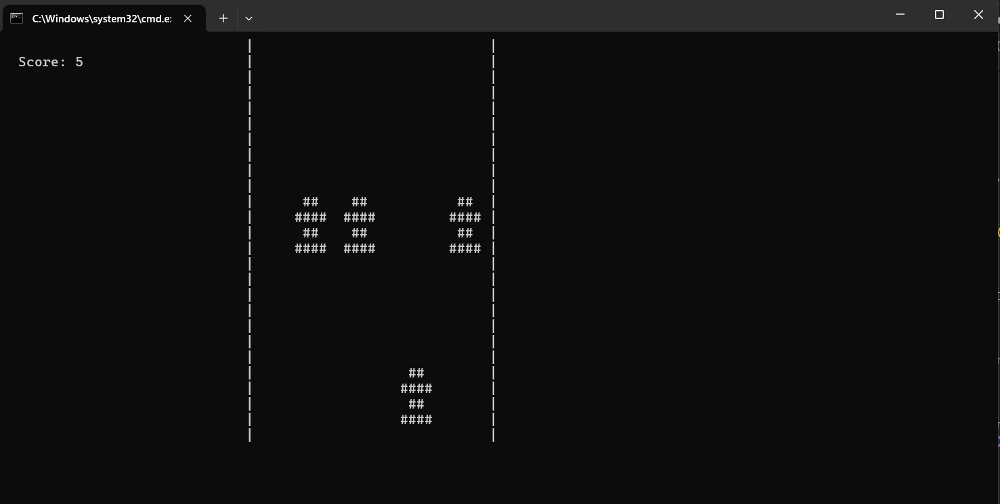
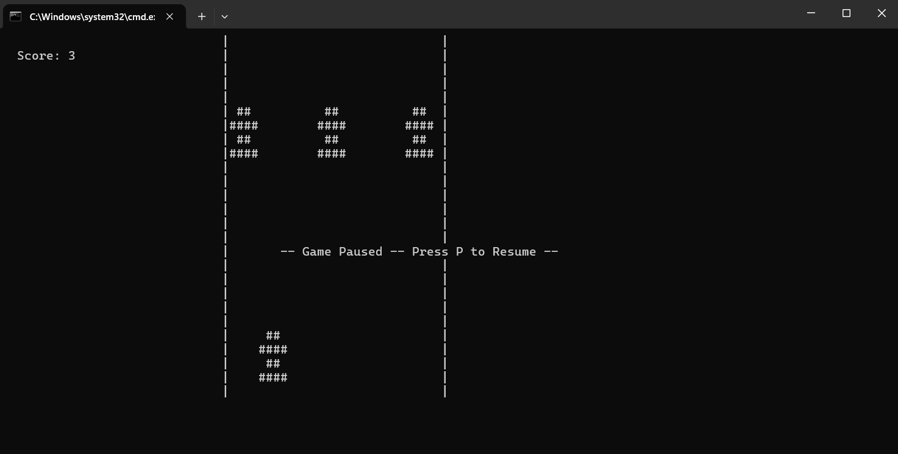
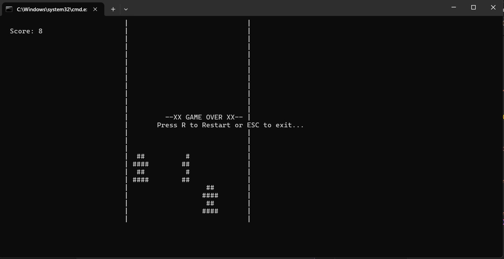

# Car Dodge Game (Console C++)

A fast-paced console-based car dodge game written in C++ for Windows. Control your car to dodge incoming enemy cars, rack up your score, and test your reflexes! 

---

## Gameplay Overview

- Steer your car left or right to avoid randomly spawning enemy cars.
- The longer you survive, the higher your score.
- Pause and resume the game at any time.
- After a collision, restart instantly or exit.

---

## Controls

| Key             | Action              |
|-----------------|---------------------|
| A / Left Arrow  | Move car left       |
| D / Right Arrow | Move car right      |
| P               | Pause/Resume game   |
| R               | Restart after game over |
| ESC             | Exit game           |

---

## Features

- Console-based gameplay with ASCII graphics
- Car movement using both WASD and arrow keys
- Randomized enemy car spawning
- Real-time collision detection
- Score tracking (score increases over time)
- Pause and resume functionality
- Restart and exit options after game over
- Clean and responsive controls

---

## How to Compile and Run

**Prerequisites:**
- Windows OS
- g++ (MinGW recommended) or any C++ compiler supporting Windows headers

**Steps:**

1. Open Command Prompt and navigate to the project directory.
2. Compile the game using g++:   g++ -o CarDodgeGame main.cpp -std=c++11

3. Run the game:   CarDodgeGame.exe

---

## Screenshots

- **Start Screen:**  

- **Gameplay:**  

- **Paused Screen:**  

- **Game Over Screen:**  

---

## Folder Structure

CarDodgeGame/
│
├── main.cpp
├── README.md
└── assets/
├── start-screen.png
├── gameplay.png
├── paused-screen.png
└── gameover-screen.png

---

## Future Improvements

- Add sound effects for collisions and scoring
- Difficulty scaling (increase enemy speed over time)
- High score saving and leaderboard
- Multiple car designs and enemy types
- Power-ups (e.g., temporary invincibility)
- Improved graphics using Unicode or color
- Cross-platform support (Linux, macOS)

---